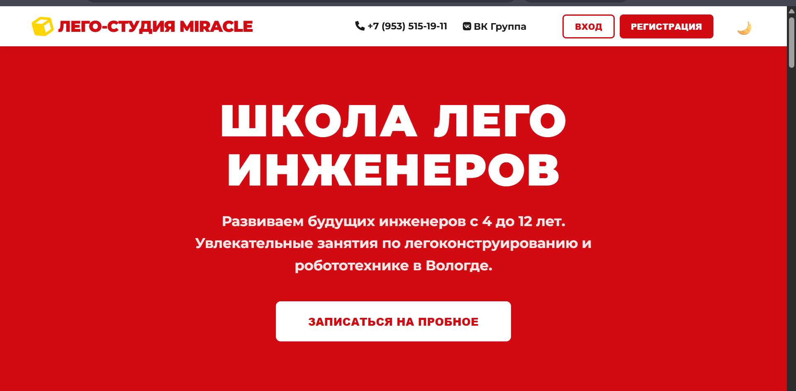
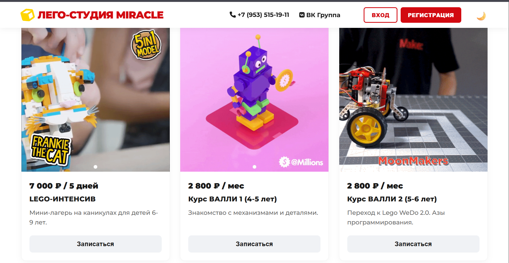
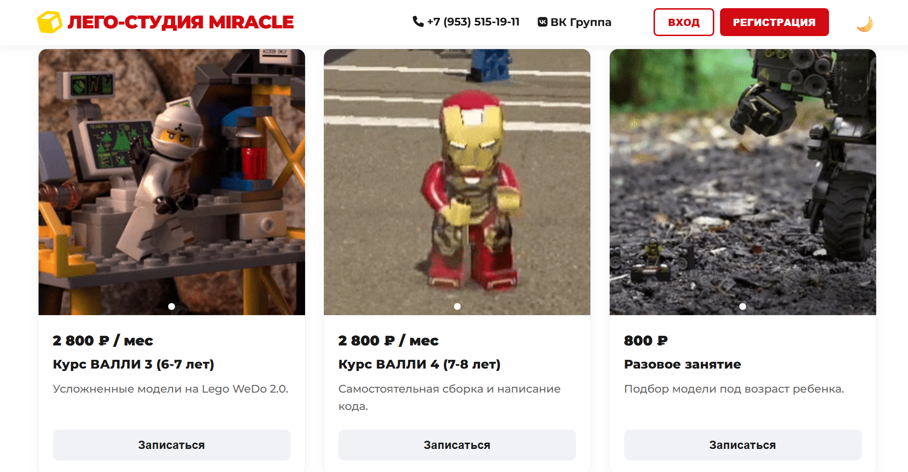

# Лего-Студия MIRACLE (г. Вологда)

Одностраничный сайт (лендинг) для Лего-студии. 

## 🔗 Ссылка на живой сайт
Проект опубликован на GitHub Pages и доступен по ссылке:  
👉 **[https://vladislavilinskij3-glitch.github.io/Lego-site/)**

## 🛠 Используемые технологии
*   **HTML5** — семантическая,  разметка.
*   **CSS3** — Flexbox и Grid для адаптивных сеток, CSS-переменные для переключения тем (light/dark), медиазапросы для мобильных устройств.
*   **JavaScript ** — работа с асинхронными запросами (`fetch`, `async/await`), обработка событий, управление локальным хранилищем (`localStorage`), слайдеры и модальные окна.
*   **Git & GitHub Pages** — система контроля версий и бесплатный хостинг.
*   **GIPHY API** — динамическая подгрузка изображений (гифок) по тематике «lego robot». При недоступности API предусмотрен резерв на локальные изображения из папок проекта.
*   **ВКонтакте API** — интеграция виджета сообщества (выпадающая карточка с возможностью подписки при наведении на ссылку в шапке).
*   **PWA (Progressive Web App)** — реализован манифест `manifest.json`, Service Worker (`sw.js`), поддержка установки приложения на устройства (кнопка 📲 На телефон).

## ✨ Реализованный функционал
*   **Адаптивная верстка:** Сайт корректно отображается на ПК, планшетах и мобильных устройствах.
*   **Динамическая загрузка контента:** Карточки услуг генерируются через JavaScript. Изображения для слайдеров подгружаются с внешнего API (GIPHY) или берутся из локальных папок (`intensiv`, `valli1` и т.д.) в случае ошибки сети или лимита запросов.
*   **Слайдер:** В каждой карточке услуги реализован кастомный слайдер с горизонтальной прокруткой и точками навигации.
*   **Модальные окна:** Реализованы окна для входа, регистрации, записи на пробное занятие, обратной связи и просмотра увеличенных изображений. Все окна закрываются по клику на тёмный фон или крестик.
*   **Регистрация/Вход:** Данные пользователей сохраняются в `localStorage`. После входа в шапке появляется приветствие, а кнопки «Вход/Регистрация» заменяются кнопкой «Выход».
*   **Переключение темы (светлая/тёмная):** Работает в один клик, выбор сохраняется в `localStorage` и восстанавливается при перезагрузке страницы.
*   **Валидация форм:** Формы «Записаться на пробное» и «Написать нам» проверяют заполнение всех полей и корректность формата (телефон, email). Данные выводятся в `console.log`.
*   **Интеграция с ВК:** Выпадающая карточка сообщества ВК появляется при наведении на ссылку «ВК Группа» в правом верхнем углу(виджет чат не реализовывал, так как сообщество пустое).
*   **PWA и установка на устройство:** Сайт имеет файл манифеста, Service Worker и работает офлайн. На ПК и мобильных устройствах доступна установка  полноценного приложения (с собственной иконкой и отдельным окном а рабочем столе).
*   
### 🚀 Что я должен сделать в будущем

Этот сайт — фронтенд-версия. Чтобы сделать его полноценным бизнес-инструментом, в нужно добавить серверную часть (Backend):

1. **Настоящая регистрация и вход.** Сейчас данные пользователей хранятся только в браузере (LocalStorage). Если человек почистит кэш, аккаунт исчезнет. Хранить пользователей в базе данных нужно  на сервере, а при регистрации отправлять на почту код подтверждения.

2. **Отправка заявок в личные сообщения ВК.** Сейчас кнопка «Записаться» просто выводит данные в консоль браузера. Нужно сделать так, чтобы данные уходили на сервер, а сервер уже пересылал их в личку администратору сообщества ВК (для этого администратор должен создать и переслать API ключ сообщества, который нужно хранить в отедьном файле, например php и разместить его на другом сервере).

3. **Картинки для услуг напрямую из ВК.** Сейчас картинки подгружаются из интернета через GIPHY. Правильнее будет брать их из фотоальбомов самого сообщества ВК. Тогда владелец студии сможет менять фото на сайте, просто обновляя их у себя в группе ВК.

5. **Статистика посещений (Яндекс.Метрика или Google Analytics).** Пока я не знаю, сколько людей заходит на сайт, какие кнопки нажимают и как долго там находятся. Интеграция с системами аналитики позволила бы отслеживать всё это и понимать, что на сайте нужно улучшить.

## 📷 Скриншоты

